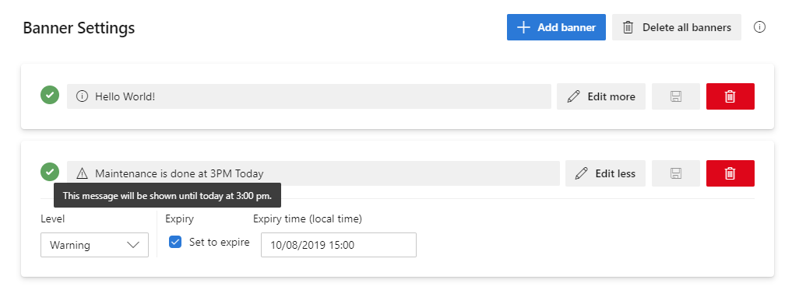

[](https://dev.azure.com/ms/banner-settings-ado-extension/_build/latest?definitionId=259&branchName=master)

Banner Settings provides a settings pane under Organization Settings to allow Project Collection Administrators to show sitewide banners. Alert your Azure DevOps users to upcoming changes or events without sending out mass emails. Compatible with Azure DevOps Services and Server.



### Features

- Show banners on any page in Azure DevOps.
- Choose between three types (levels) of messages: Info, Warning, and Error.
- Choose an expiration date for a message.
- Include hyperlinks in your banners using markdown syntax like the banner message below.

```markdown
Windows October Update released! Please visit the [Windows Insider Blog](https://blogs.windows.com/windowsexperience/tag/windows-insider-program/) for more info.
```

### Restrictions

- Only one banner can be shown at a time to keep the interface clean. Banners are prioritized by level. For example, if you have posted a warning message and an info message, the info message will only be shown after a user closes the warning message, or you delete the warning message.
- Banners are restricted to a length of thirty words.

### Building the project

Just run:

    npm run build:dev
    npm run package:dev

This produces a .vsix file which can be uploaded to the [Visual Studio Marketplace](https://marketplace.visualstudio.com/azuredevops)

Publish it to your own publisher by running:

    npm run publish:dev

You can then serve the extension locally and visit your newly published dev environment extension using

    npm run dev

### Contributing

This project welcomes contributions and suggestions.  Most contributions require you to agree to a
Contributor License Agreement (CLA) declaring that you have the right to, and actually do, grant us
the rights to use your contribution. For details, visit https://cla.opensource.microsoft.com.

When you submit a pull request, a CLA bot will automatically determine whether you need to provide
a CLA and decorate the PR appropriately (e.g., status check, comment). Simply follow the instructions
provided by the bot. You will only need to do this once across all repos using our CLA.

This project has adopted the [Microsoft Open Source Code of Conduct](https://opensource.microsoft.com/codeofconduct/).
For more information see the [Code of Conduct FAQ](https://opensource.microsoft.com/codeofconduct/faq/) or
contact [opencode@microsoft.com](mailto:opencode@microsoft.com) with any additional questions or comments.